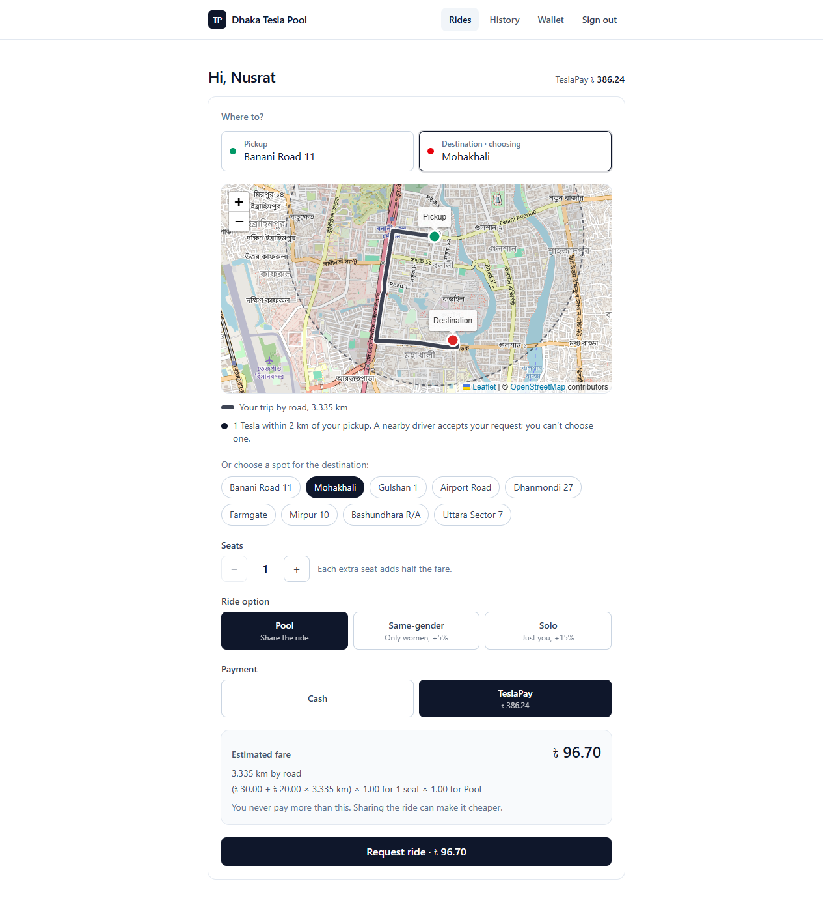
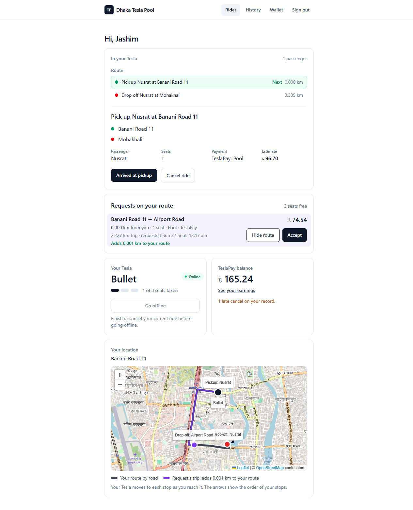
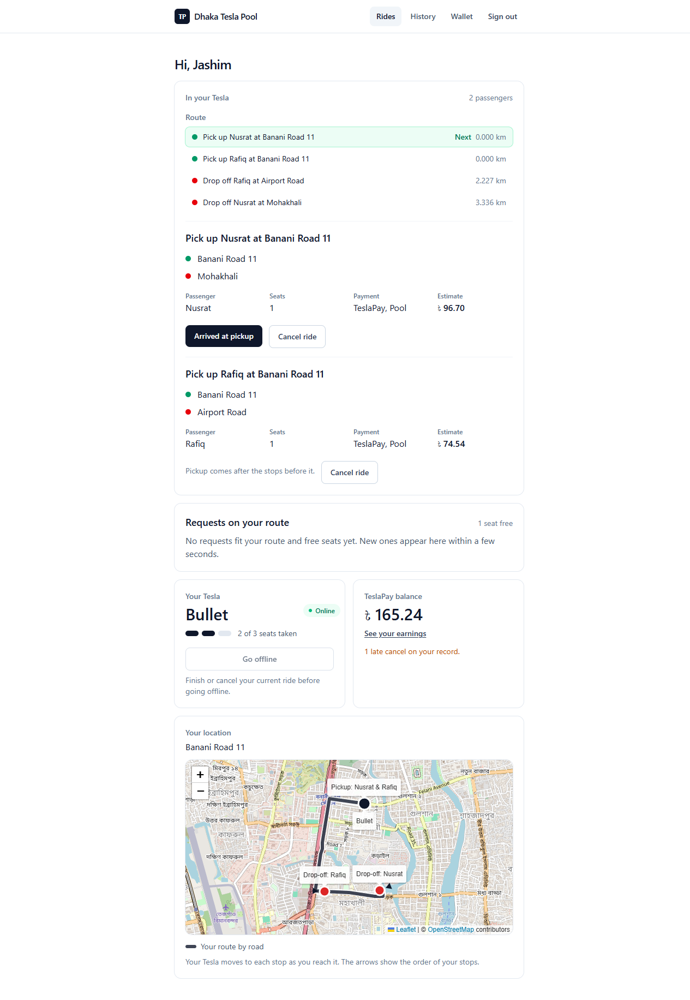
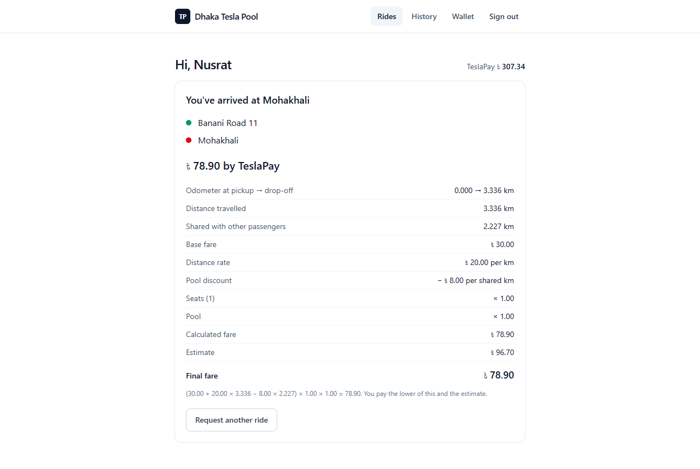
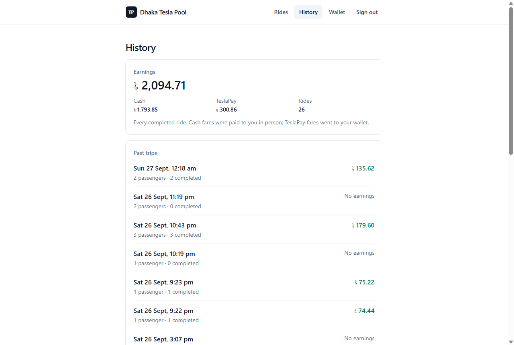
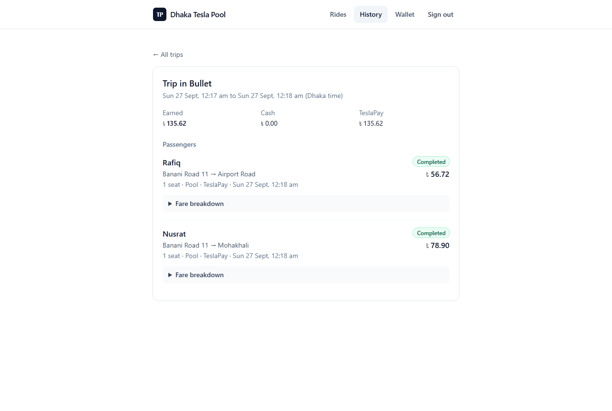
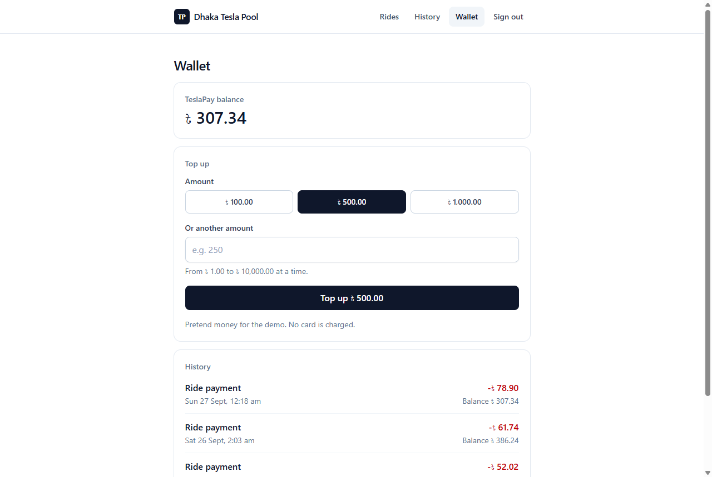
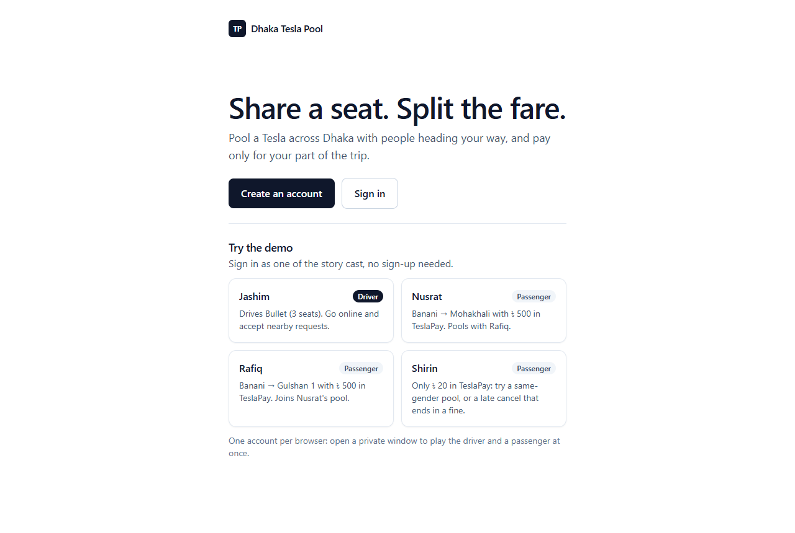
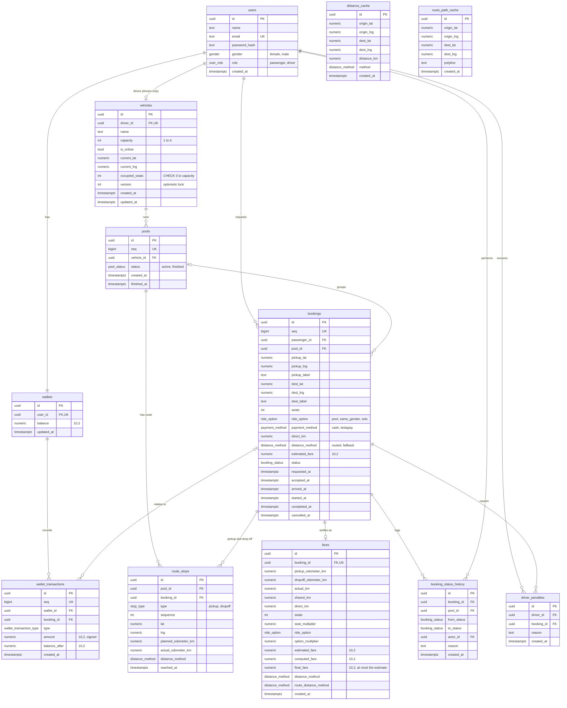

# Dhaka Tesla Pool

Share a seat. Split the fare. Survive Dhaka traffic.

Dhaka Tesla Pool is a ride-pooling app. Passengers ask for a ride, and a driver takes
several of them in one Tesla when their trips go the same way. The Tesla never carries more
people than it has seats, and each passenger pays only for their own part of the trip.

- **Live site:** https://dhaka-tesla-pool-omega.vercel.app (the first visit can take a
  minute while the free server wakes up)
- **Demo video:** _added at release_ (see [Demo video](#demo-video))
- **Try it without signing up:** one-tap demo accounts, see [Demo credentials](#demo-credentials)

## Contents

- [Problem](#problem)
- [Features](#features)
- [Screenshots](#screenshots)
- [Architecture and database](#architecture-and-database)
- [Tech stack and why](#tech-stack-and-why)
- [Project structure](#project-structure)
- [Prerequisites](#prerequisites)
- [Environment variables](#environment-variables)
- [Run it locally](#run-it-locally)
- [Tests](#tests)
- [Demo credentials](#demo-credentials)
- [Deployment](#deployment)
- [API overview](#api-overview)
- [Key decisions and trade-offs](#key-decisions-and-trade-offs)
- [Assumptions](#assumptions)
- [Known limitations](#known-limitations)
- [Next improvements](#next-improvements)
- [If it goes viral (bonus)](#if-dhaka-tesla-pool-goes-viral-bonus)
- [AI Usage](#ai-usage)
- [Demo video](#demo-video)

## Problem

At 8:41 AM on Banani Road 11, Nusrat books a ride to Mohakhali. Two minutes later Rafiq
books almost the same route to Gulshan 1. Jashim's three-seat Tesla, "Bullet", could take
both. Then Shirin tries for the last seat.

The app has to decide who can share a ride and split the fare fairly. It must never sell
more seats than Bullet has, even when two people tap at the same moment. And it has to keep
enough history to explain afterwards exactly what happened.

## Features

**Passengers** (Nusrat, Rafiq, Shirin)

- Sign up, sign in and sign out.
- Pick a pickup and destination on a map of Dhaka, or with one-tap quick picks.
- See the Teslas near the pickup, the trip drawn by road, and the fare estimate before
  booking.
- Choose seats (1 or more), a ride option (Pool, Same-gender pool or Solo) and how to pay
  (Cash or TeslaPay).
- Follow the ride: waiting → accepted → driver arrived → on the way → completed or cancelled.
- Cancel for free while waiting, or within 3 minutes of a driver accepting. After that, a
  30 tk fine applies.
- See past rides, each with its fare worked out step by step.
- Top up a TeslaPay wallet (pretend money) and see every movement in it.

**Driver** (Jashim, with Bullet)

- Go online or offline, and set where the Tesla is.
- See open requests nearby. Once passengers are aboard, see only requests that fit the
  route, with the extra km each one adds.
- Accept requests into one shared trip, and take each stop in order: arrived, start,
  complete.
- Cancel a ride before pickup (it goes back to waiting for any driver), or mark a no-show
  after waiting 5 minutes.
- See the route by road, every passenger and seat, past trips and earnings.

**Pooling and money**

- Several passengers share one Tesla when their trips overlap (the matching rule, below).
- Seats taken can never go over the Tesla's capacity, even under simultaneous accepts.
- Each passenger gets their own fare, with a discount for the km they share.
- Solo rides ride alone, and same-gender pools share only with passengers of the same
  gender.
- Paying by TeslaPay moves the fare from the passenger's wallet to the driver's when the
  ride completes.
- Every status change, fare, wallet entry and penalty is stored and can never be edited.

## Screenshots

| Passenger: request with estimate and road route               | Driver: a request on the route, drawn over the driver's road            |
| ------------------------------------------------------------- | ----------------------------------------------------------------------- |
|  |  |
| **Driver: the pooled trip, stops in order**                   | **Passenger: the final fare, worked out**                               |
|        |                   |
| **Driver: earnings and past trips**                           | **Driver: one past trip, fare per passenger**                           |
|              |                           |
| **Passenger: TeslaPay wallet**                                | **Home page with the demo accounts**                                    |
|               |                               |

These show Nusrat (Banani Road 11 → Mohakhali) and Rafiq (Banani Road 11 → Airport Road)
sharing Bullet, with road distances from OpenRouteService.

## Architecture and database

### Architecture


The browser talks only to the Next.js website. The website passes every `/api/v1/*` call on
to the Express API, so the login cookie belongs to the website's own address and works even
though the two run on different hosts. The API holds all the rules and is the only thing
that touches the PostgreSQL database. OpenRouteService gives road distances and road shapes.
When it can't answer, the API uses the straight-line distance × 1.3 instead.

We kept it to one API and one database on purpose. Every seat claim is settled by one row in
Postgres, so there is nothing else to keep in step.

### Database (ERD)


The drawing above was made while designing. The diagram below is written from the code
(`apps/api/src/db/schema/`), so it matches the database exactly.



What each table is for:

| Table                    | Holds                                                                                         |
| ------------------------ | --------------------------------------------------------------------------------------------- |
| `users`                  | Passengers and drivers, with a bcrypt password hash                                           |
| `wallets`                | One TeslaPay balance per user                                                                 |
| `vehicles`               | A driver's Tesla: seats, seats taken, online status, location, and a version for safe updates |
| `pools`                  | One trip by one Tesla, grouping every booking it carries                                      |
| `bookings`               | One passenger's ride request and its lifecycle times                                          |
| `booking_status_history` | Every status change, who made it and why. Can't be edited or deleted.                         |
| `route_stops`            | A trip's pickups and drop-offs in order, with the km reading at each. Readings can't change.  |
| `fares`                  | The final fare of a completed ride and every number used to work it out. Can't be changed.    |
| `wallet_transactions`    | The money ledger: top-ups, payments, credits, cash earnings and fines. Append-only.           |
| `driver_penalties`       | A record each time a driver cancels late                                                      |
| `distance_cache`         | Road distances already asked for, so the map service isn't asked twice                        |
| `route_path_cache`       | Road shapes already asked for, used only to draw the map                                      |

### Design documents

The specs were written before the code, and each phase started from its Low-Level Design.

| Document                                                                                                                                                                                                                                                                                                                                                                                                     | What it holds                                                     |
| ------------------------------------------------------------------------------------------------------------------------------------------------------------------------------------------------------------------------------------------------------------------------------------------------------------------------------------------------------------------------------------------------------------ | ----------------------------------------------------------------- |
| [Functional Requirements](docs/Dhaka_Tesla_Pool_Functional_Requirements.md)                                                                                                                                                                                                                                                                                                                                  | FR-\* IDs, the booking state machine, fare formulas, out of scope |
| [Non-Functional Requirements](docs/Dhaka_Tesla_Pool_Non_Functional_Requirements.md)                                                                                                                                                                                                                                                                                                                          | NFR-\* IDs: speed, security, reliability, testing, API rules      |
| [Core Entities](docs/Dhaka_Tesla_Pool_Core_Entities.md)                                                                                                                                                                                                                                                                                                                                                      | Every entity and its fields                                       |
| [API Routes](docs/Dhaka_Tesla_Pool_API_Routes.md)                                                                                                                                                                                                                                                                                                                                                            | Every route, grouped by role                                      |
| [Development Plan](docs/Dhaka%20Tesla%20Pool%20—%20Development%20Plan.md)                                                                                                                                                                                                                                                                                                                                    | The phases, the git flow, and changes made along the way          |
| [Deployment guide](docs/deployment.md)                                                                                                                                                                                                                                                                                                                                                                       | Setting up Neon, Render and Vercel                                |
| Low-Level Designs: [1 accounts](docs/lld/phase-1-accounts.md), [2 ride requests](docs/lld/phase-2-ride-request.md), [3 driver flow](docs/lld/phase-3-driver-flow.md), [4 seats](docs/lld/phase-4-seat-capacity.md), [5 pooling](docs/lld/phase-5-tesla-pooling.md), [6 TeslaPay](docs/lld/phase-6-teslapay.md), [7 ride options](docs/lld/phase-7-ride-options.md), [8 history](docs/lld/phase-8-history.md) | Tables, routes, rules and tests for each phase                    |
| Later additions: [driver map](docs/lld/driver-map.md), [nearby Teslas](docs/lld/passenger-nearby-teslas.md), [road routes](docs/lld/route-paths.md)                                                                                                                                                                                                                                                          | Features added after phase 8                                      |

## Tech stack and why

The brief fixes TypeScript/JavaScript, React or Next.js, and Node.js. Everything else was
our choice.

| Part           | Pick                                           | Alternatives               | Why it fits a ride-pooling app                                                                                                                                                                        | What would make us switch                                          |
| -------------- | ---------------------------------------------- | -------------------------- | ----------------------------------------------------------------------------------------------------------------------------------------------------------------------------------------------------- | ------------------------------------------------------------------ |
| Language       | TypeScript (web and API)                       | JavaScript                 | One type system from the database to the screen catches mismatched shapes early (NFR-25).                                                                                                             | Nothing realistic here.                                            |
| Frontend       | Next.js (App Router)                           | React + Vite + a router    | Routing and layouts built in. Its rewrites give a same-origin proxy to the API, so the login cookie works without CORS.                                                                               | A fully static client with no need for a proxy.                    |
| Backend        | Express 5                                      | Fastify, NestJS            | Small and well known. Express 5 passes async errors to the error handler. About 30 routes didn't need NestJS's structure.                                                                             | Throughput limits (Fastify), or a large team (NestJS).             |
| Database       | PostgreSQL 17                                  | MySQL, SQLite              | Seat and claim rules need row locks, conditional `UPDATE … WHERE`, CHECK constraints, partial unique indexes and triggers. SQLite locks the whole file on writes, so it can't show a real seat race.  | Nothing at this scale. At very large scale, replicas and sharding. |
| ORM            | Drizzle (+ drizzle-kit)                        | Prisma, Kysely             | Queries read like the SQL they run, so the concurrency rules stay visible. drizzle-kit writes plain SQL migrations we can review and edit. `numeric` comes back as a string, which suits exact money. | Hand-written SQL everywhere (Kysely), or a team used to Prisma.    |
| Validation     | Zod                                            | Joi                        | TypeScript types come straight from the schemas. It also checks the environment variables at startup (NFR-10, NFR-11).                                                                                | Nothing expected.                                                  |
| Tests          | Vitest                                         | Jest                       | Runs TypeScript and ES modules with no setup. Tests call the real HTTP API with `fetch` against a real Postgres.                                                                                      | Nothing expected.                                                  |
| Money maths    | big.js                                         | decimal.js, integer poysha | Exact decimal maths with half-up rounding. Plain JavaScript numbers get some fares wrong: (30 + 20 × 0.115) × 1.15 comes out as 37.144999…, not 37.145.                                               | Needing functions big.js lacks (decimal.js).                       |
| Styling        | Tailwind CSS                                   | CSS Modules                | Layouts that work on phones and laptops (NFR-21) without a growing pile of CSS files.                                                                                                                 | A designer-owned design system.                                    |
| Map            | react-leaflet + OpenStreetMap tiles            | MapLibre                   | Small, needs no API key, and shows the OpenStreetMap credit (NFR-24).                                                                                                                                 | Vector maps or heavy map interaction (MapLibre).                   |
| Road distances | OpenRouteService, fallback straight line × 1.3 | OSRM, a zone table         | A free key with enough quota. The fallback keeps the app working with no key at all (NFR-13).                                                                                                         | Running out of quota: host OSRM ourselves.                         |
| Logging        | pino + pino-http                               | winston, morgan            | JSON logs with a request id on every line, and no headers, so cookies never reach the logs (NFR-42, NFR-43).                                                                                          | A hosted log service with its own agent.                           |
| Passwords      | bcryptjs                                       | bcrypt, argon2             | The bcrypt algorithm (NFR-7) in plain JavaScript, so the Docker images need no native build.                                                                                                          | Login throughput: native bcrypt or argon2.                         |
| Auth           | Signed JWT in an HttpOnly cookie, 24 h         | Server sessions table      | No session table to query on every request, and any number of API copies can check it.                                                                                                                | Needing to revoke a session at once (add a sessions table).        |
| Hosting        | Vercel, Render (Singapore), Neon (Singapore)   | Railway, Fly.io            | All free. The API and database sit in the same region, close to Dhaka.                                                                                                                                | Free-tier sleep becoming unacceptable.                             |
| CI             | GitHub Actions                                 | —                          | Formatting, lint, type checks, build and all tests against Postgres on every pull request (NFR-30).                                                                                                   | —                                                                  |

Version pins: TypeScript stays at 6.0 because typescript-eslint doesn't support 7 yet, and
ESLint stays at 9 because Next's lint plugins don't support 10 yet.

## Project structure

```
apps/
  api/                 Express API
    src/
      app.ts           builds the app (no listen), used by server.ts and the tests
      server.ts        starts listening and shuts down cleanly
      config.ts        checks the environment variables
      http/            error format and middleware (request log, sign-in, role checks)
      auth/            password hashing and the signed login cookie
      domain/          pure rules with no I/O: fares, state machine, matching, ride options
      geo/             Dhaka area, OpenRouteService client, the × 1.3 fallback
      services/        business rules and database transactions
      routes/          /health and /api/v1
      db/              schema, migrations runner and seed
    drizzle/           SQL migrations
    test/              Vitest tests against a real Postgres
  web/                 Next.js website (App Router + Tailwind)
docs/                  specs, diagrams, Low-Level Designs, screenshots, deployment guide
docker-compose.yml     website + API + database
render.yaml            API deployment on Render
.github/workflows/     CI
```

npm workspaces tie the two apps together, with one `package-lock.json` at the root.

## Prerequisites

- Docker with Compose v2, to run everything
- Node.js 24 and npm 11, only to develop or run the tests outside Docker

## Environment variables

Every variable is listed in [.env.example](.env.example) with a safe local default. Real
secrets live only in the hosting dashboards, never in the repo (NFR-11).

| Variable                                            | Used by     | Purpose                                                                       |
| --------------------------------------------------- | ----------- | ----------------------------------------------------------------------------- |
| `POSTGRES_USER`, `POSTGRES_PASSWORD`, `POSTGRES_DB` | compose     | Database login; compose builds the API's database address from them           |
| `POSTGRES_PORT`, `API_PORT`, `WEB_PORT`             | compose     | Ports on your machine                                                         |
| `DATABASE_URL`                                      | api         | Postgres address (`postgres://…`)                                             |
| `PORT`                                              | api         | HTTP port, default 4000                                                       |
| `NODE_ENV`                                          | api         | `development` turns on readable logs                                          |
| `LOG_LEVEL`                                         | api         | Log level, default `info`                                                     |
| `SESSION_SECRET`                                    | api         | Signs the login cookie. At least 32 characters. Required.                     |
| `COOKIE_SECURE`                                     | api         | HTTPS-only cookie; on by default when `NODE_ENV=production`                   |
| `ORS_API_KEY`                                       | api         | OpenRouteService key. Optional: without it, distances are straight line × 1.3 |
| `ORS_BASE_URL`                                      | api         | OpenRouteService address                                                      |
| `DRIVER_SEARCH_RADIUS_KM`                           | api         | How far from the Tesla (straight line) a driver sees requests, default 2      |
| `TEST_DATABASE_URL`                                 | api tests   | A separate test database, created automatically                               |
| `API_URL`                                           | web (build) | Where the website sends `/api/v1/*`. Read at **build** time.                  |

A free OpenRouteService key: [openrouteservice.org/dev/#/signup](https://openrouteservice.org/dev/#/signup).

## Run it locally

### With Docker (recommended)

```sh
docker compose up --build
```

| Service | Address               | Notes                                           |
| ------- | --------------------- | ----------------------------------------------- |
| web     | http://localhost:3000 | Open this one. It passes `/api/v1/*` to the API |
| api     | http://localhost:4000 | `/health`, `/health/ready`, `/api/v1/*`         |
| db      | localhost:5432        | Postgres 17, user and password `tesla`/`tesla`  |

No `.env` file is needed. The API waits for Postgres, applies the migrations, loads the
seed data, then starts. The website waits until the API is ready. To use real road
distances, copy `.env.example` to `.env` and set `ORS_API_KEY` first.

Start again from an empty database with `docker compose down -v`.

### Without Docker

```sh
cp .env.example .env
npm ci
docker compose up -d db              # or point DATABASE_URL at any Postgres 17
npm run db:migrate -w @tesla-pool/api
npm run db:seed -w @tesla-pool/api
npm run dev -w @tesla-pool/api       # http://localhost:4000, restarts on change
npm run dev -w @tesla-pool/web       # http://localhost:3000, in a second terminal
```

### Migrations and seed data

- To change the schema, edit `apps/api/src/db/schema/`, then run
  `npm run db:generate -w @tesla-pool/api`. It writes a new SQL file in `apps/api/drizzle/`
  to review and commit (NFR-31).
- `npm run db:migrate -w @tesla-pool/api` applies migrations that haven't run yet. The
  Docker container does this every time it starts.
- `npm run db:seed -w @tesla-pool/api` loads the story cast. It's safe to repeat: existing
  users are left alone, so a restart never wipes your demo progress.

## Tests

```sh
docker compose up -d db     # the tests need a real Postgres
npm test                    # Vitest, on its own tesla_pool_test database
npm run lint
npm run typecheck
npm run format:check
npm run build
```

CI runs all of these on every pull request. Tests never call the real map service; a local
stand-in answers instead. Race tests run against a real Postgres and repeat 25 times each.

What the tests cover, starting with the risks the brief names:

- **Bullet's capacity can never be exceeded.** Seats fill one by one and then refuse. Five
  accepts fired at once never put more than 3 people in Bullet. Raw SQL can't overfill a
  Tesla either, because a CHECK constraint stops it.
- **Two requests at once can't corrupt capacity.** Nusrat and Shirin race for the last
  seat and exactly one wins. Three drivers race for one request and one wins. Accepts race
  against steps and cancels. After every round, each Tesla's seats taken must equal the
  seats of the bookings it carries.
- **Invalid state changes are refused.** Every allowed change in the booking state machine
  works, and skipped or repeated steps, wrong actors and out-of-order stops are refused.
- **Nusrat's and Rafiq's pooled fares are right.** ৳ 52.02 and ৳ 71.42 with no map key,
  matching the hand calculation below, and the FR §8 worked examples.
- **Nobody can touch another user's ride.** Another passenger's booking or another driver's
  trip is 404. The wrong role gets 403. A passenger never sees a co-passenger.
- **Cancellation rules hold.** Free while waiting and for 3 minutes after acceptance, then a
  30 tk fine, by the database clock. No-show only after 5 minutes. Late driver cancels
  record a penalty.
- **Money stays correct.** Double-tapped cancels, completes and top-ups charge once. After
  every race round, each wallet balance equals the sum of its ledger.
- Also covered: sign-up and sign-in, sessions, the error format, road distances and the
  fallback, the matching rule, ride options, history paging, and seed idempotency.

## Demo credentials

Every seeded account uses the password **`TeslaPool#2026`**.

| Name   | Email                 | Role      | Gender | Starting TeslaPay | Why                                               |
| ------ | --------------------- | --------- | ------ | ----------------- | ------------------------------------------------- |
| Jashim | jashim@teslapool.test | driver    | male   | ৳ 0.00            | Drives Bullet (3 seats), parked at Banani Road 11 |
| Nusrat | nusrat@teslapool.test | passenger | female | ৳ 500.00          | Pays the pooled ride by TeslaPay                  |
| Rafiq  | rafiq@teslapool.test  | passenger | male   | ৳ 500.00          | Pays the pooled ride by TeslaPay                  |
| Shirin | shirin@teslapool.test | passenger | female | ৳ 20.00           | A 30 tk fine takes her below zero                 |

### How the demo accounts work in the website

You never need to type these in.

- The **home page** has a **Try the demo** section with one button per person. Tap one and
  you are signed in as them.
- The **sign-in page** shows the same buttons under the form.

The buttons use the normal sign-in (`POST /api/v1/auth/login`) with the password above, so
nothing on the server is special for demo accounts. The list lives in
[`apps/web/src/lib/demo.ts`](apps/web/src/lib/demo.ts) and the buttons in
[`apps/web/src/components/DemoAccounts.tsx`](apps/web/src/components/DemoAccounts.tsx).

A browser holds one sign-in at a time. To be the driver and a passenger together, use a
normal window for one and a private window for the other.

### Things to try

**A single ride.** Sign in as Jashim and tap **Go online**. In a private window, sign in as
Nusrat, set the pickup to **Banani Road 11** and the destination to **Mohakhali**, get the
estimate and request it. Within a few seconds it appears for Jashim. **See route** draws her
trip on his map. Accept it, then tap **Arrived at pickup**, **start trip** and **complete
trip**. Nusrat's screen follows each step and ends with her fare, worked out.

**A pooled ride.** With Jashim online at Banani Road 11, have Nusrat request Banani Road 11 →
Mohakhali and accept it. Rafiq's destination depends on whether a map key is set (both
[worked out below](#pooling)):

- **With a key** (the live site): Rafiq picks the **Airport Road** quick pick. Jashim sees
  it under **Requests on your route**, adding 0.001 km. Accept it. Rafiq is dropped first,
  and they pay ৳ 56.72 and ৳ 78.90. Each sees only their own fare.
- **With no key** (a fresh `docker compose up`): Rafiq picks **Gulshan 1**. It adds
  0.970 km. Nusrat pays ৳ 52.02 and Rafiq ৳ 71.42. Paid by TeslaPay, their wallets end at
  ৳ 447.98 and ৳ 428.58, and Jashim's at ৳ 123.44.

**The last-seat race.** With Jashim online, have Rafiq request 2 seats and accept it: Bullet
shows 2 of 3 seats taken. Then Nusrat and Shirin each request 1 seat along Rafiq's way. Open
Jashim's screen in two tabs and tap **Accept** on a different request in each, at the same
moment. One gets the seat; the other is told there's no free seat any more.

**Same-gender pool.** Nusrat and Shirin both request Banani Road 11 → Mohakhali as
**Same-gender**, and Rafiq requests a Pool ride. After Jashim accepts Nusrat, only Shirin's
request is listed. Rafiq's appears once both women are dropped off. Trip marked **Women
only**.

**Solo.** Rafiq requests **Solo**. While he rides, Jashim sees no other requests. He pays his
estimate (the Solo price is +15%).

**A late-cancel fine.** Shirin requests a Cash ride and Jashim accepts. After 3 minutes her
screen says cancelling now costs ৳ 30.00. Cancelling takes her from ৳ 20.00 to −৳ 10.00, and
she can't request again until she tops up on the **Wallet** page. To skip the wait locally:
`docker compose exec db psql -U tesla -d tesla_pool -c "UPDATE bookings SET accepted_at = accepted_at - interval '3 minutes' WHERE status = 'ACCEPTED'"`.

**A no-show.** Accept a ride and tap **Arrived at pickup**. After 5 minutes a **No-show**
button appears. It cancels the ride and fines the passenger ৳ 30.00.

**History.** Nusrat's **History** lists her finished rides, each with its fare step by step.
Jashim's shows his earnings split into Cash and TeslaPay, and every past trip.

After a trip, Bullet stays where it ended. Set Jashim's location back to **Banani Road 11**
before replaying a story.

## Deployment

**Live site: https://dhaka-tesla-pool-omega.vercel.app**

| Part     | Where                    | Address                                                                           |
| -------- | ------------------------ | --------------------------------------------------------------------------------- |
| Website  | Vercel                   | https://dhaka-tesla-pool-omega.vercel.app                                         |
| API      | Render, Singapore (free) | Reached through the website: `https://dhaka-tesla-pool-omega.vercel.app/api/v1/…` |
| Database | Neon, Singapore (free)   | Private                                                                           |

Checked on 27 Sep 2026 by running the pooled ride on the live site. Nusrat (Banani Road 11 →
Mohakhali, TeslaPay) and a second passenger (Banani Road 11 → Airport Road, Cash) shared
Bullet. They paid ৳ 78.90 and ৳ 56.72, as in [Example 2](#pooling), and Jashim's earnings
read ৳ 135.62.

The live site has an OpenRouteService key, so maps show real roads and the
[with-key pooling example](#pooling) applies.

**The first visit can be slow.** The free API server sleeps after 15 minutes with no
visitors and takes about a minute to wake. If the first sign-in hangs, wait a moment and
try again.

Deploying it yourself takes about 15 minutes on free accounts: see the
[deployment guide](docs/deployment.md). A push to `pre-release` redeploys both the website
and the API, and the API applies any new migrations as it starts.

## API overview

REST over JSON. We picked REST because every action maps cleanly to a resource and a verb
(request a booking, accept it, cancel it), and plain HTTP is easy to test with `fetch`.

Everything is under `/api/v1` except the two health checks. Full request and response
shapes are in [the API Routes spec](docs/Dhaka_Tesla_Pool_API_Routes.md) and each phase's
Low-Level Design.

| Who       | Method and route                                                     | What it does                                                                |
| --------- | -------------------------------------------------------------------- | --------------------------------------------------------------------------- |
| anyone    | `GET /health`, `GET /health/ready`                                   | The process is up; the database answers (503 if not)                        |
| anyone    | `POST /auth/signup`, `/auth/login`, `/auth/logout`                   | Create an account (with wallet, and a Tesla for drivers), sign in, sign out |
| signed in | `GET /me`                                                            | The user, wallet balance, Tesla and current booking                         |
| signed in | `GET /wallet`, `GET /wallet/transactions`                            | The balance, and every money movement (paged)                               |
| passenger | `POST /fare-estimates`                                               | Distance, road shape and fare estimate. Books nothing.                      |
| passenger | `GET /nearby-teslas?lat=…&lng=…`                                     | Teslas with a free seat near a pickup, rounded, no names                    |
| passenger | `POST /bookings`                                                     | Request a ride. The same request again returns the same booking.            |
| passenger | `GET /bookings/current`, `GET /bookings/:id`                         | The active ride (polled every 4 s), or one of your rides                    |
| passenger | `GET /bookings/:id/path`                                             | Your ride's road, pickup to destination                                     |
| passenger | `POST /bookings/:id/cancel`                                          | Cancel (free, or fined after 3 minutes)                                     |
| passenger | `GET /bookings`                                                      | Ride history (paged)                                                        |
| passenger | `POST /wallet/top-ups`                                               | Add pretend money. A repeated id adds it once.                              |
| driver    | `GET /driver/vehicle`                                                | The Tesla: seats, seats taken, online, location                             |
| driver    | `POST /driver/vehicle/online`, `/offline`                            | Go online or offline                                                        |
| driver    | `PUT /driver/vehicle/location`                                       | Set where the Tesla is                                                      |
| driver    | `GET /driver/requests`                                               | Requests nearby, or on the route once passengers are aboard                 |
| driver    | `GET /driver/requests/:bookingId/path`                               | A request's own road, to preview it                                         |
| driver    | `POST /driver/requests/:id/accept`                                   | Accept into the trip                                                        |
| driver    | `GET /driver/pool`, `GET /driver/pool/path`                          | The current trip, its stops and its road                                    |
| driver    | `POST /driver/bookings/:id/arrive`, `/start`, `/complete`            | The next step for one passenger                                             |
| driver    | `POST /driver/bookings/:id/cancel`, `/no-show`                       | Drop a passenger before pickup, or mark a no-show                           |
| driver    | `GET /driver/pools`, `GET /driver/pools/:id`, `GET /driver/earnings` | Past trips and earnings                                                     |

**Errors** always look like this (NFR-35):

```json
{ "error": { "code": "SEATS_UNAVAILABLE", "message": "…", "details": [] } }
```

- 400: bad input
- 401: not signed in
- 403: the wrong role
- 404: not found, or someone else's
- 409: a conflict, such as `ALREADY_CLAIMED`, `SEATS_UNAVAILABLE`, `POOL_CHANGED` or `INVALID_TRANSITION`
- 422: a business rule, such as `NEGATIVE_BALANCE` or `NO_LONGER_MATCHES`

Every response carries an `X-Request-Id`, which also appears in that request's log line.

## Key decisions and trade-offs

### The ride lifecycle

`REQUESTED → ACCEPTED → DRIVER_ARRIVED → STARTED → COMPLETED`, and `CANCELLED` from any
step before `STARTED`. We merged the brief's "MATCHED" into `ACCEPTED`, because here a match
only exists once a driver accepts. A driver cancel sends the booking back to `REQUESTED`, so
another driver can take it.

Every change is one `UPDATE … WHERE id = ? AND status = <expected>`, plus a
`booking_status_history` row in the same transaction. Anything else is refused.

### Pooling

**The route.** Each trip has a list of stops in order: a pickup and a drop-off for each
passenger. Each stop has its km along the trip, like an odometer reading. When the driver
reaches a stop, its reading is stored and can never change (FR-L5, NFR-41).

**The matching rule (FR-L3).** A new request joins a trip with passengers only if:

1. its pickup is on the route ahead (visiting it adds at most 1 km),
2. its drop-off is on the route after the pickup, or past the route's end in the same
   direction,
3. nobody's ride, the newcomer's included, grows more than 1 km beyond their direct trip,
4. nobody would pay more than their estimate (`detour ≤ 0.4 × shared km`, the fare formula
   rearranged), and
5. there are enough free seats.

Every place for the two new stops is tried, and the shortest route wins. The rule lives in
[`domain/matching.ts`](apps/api/src/domain/matching.ts), with no database or network code,
so it's easy to test (NFR-26).

**Nusrat and Rafiq's trip.** Whether they pool depends on how distance is measured, so there
are two worked examples.

**Example 1: no map key** (straight line × 1.3). Banani → Mohakhali 1.835 km, Banani →
Gulshan 1 2.287 km, Mohakhali → Gulshan 1 0.970 km. Dropping Nusrat first makes Rafiq's ride
2.805 km instead of 2.287, a 0.518 km detour. That is under 1 km, and under 0.4 × 1.835 =
0.734, so he fits.

| Fare = 30 + 20 × actual km − 8 × shared km, capped at the estimate | Nusrat             | Rafiq              |
| ------------------------------------------------------------------ | ------------------ | ------------------ |
| Odometer at pickup → drop-off                                      | 0.000 → 1.835      | 0.000 → 2.805      |
| Actual km, shared km                                               | 1.835, 1.835       | 2.805, 1.835       |
| Estimate: 30 + 20 × direct km                                      | 30 + 36.70 = 66.70 | 30 + 45.74 = 75.74 |
| Computed                                                           | 30 + 36.70 − 14.68 | 30 + 56.10 − 14.68 |
| **Final**                                                          | **৳ 52.02**        | **৳ 71.42**        |

**Example 2: with a key** (real roads, measured on 26 Sep 2026; road data can change a
little). By road, Rafiq to Gulshan 1 would be a 1.150 km detour, over the 1 km limit, so
it's refused. That's the rule working, not a bug. Rafiq to **Airport Road**, a point on
Nusrat's road, pools. His direct trip is 2.227 km, and he's dropped first.

| Fare = 30 + 20 × actual km − 8 × shared km, capped at the estimate | Nusrat              | Rafiq (Airport Road) |
| ------------------------------------------------------------------ | ------------------- | -------------------- |
| Odometer at pickup → drop-off                                      | 0.000 → 3.336       | 0.000 → 2.227        |
| Actual km, shared km                                               | 3.336, 2.227        | 2.227, 2.227         |
| Estimate: 30 + 20 × direct km                                      | 30 + 66.70 = 96.70  | 30 + 44.54 = 74.54   |
| Computed                                                           | 30 + 66.72 − 17.816 | 30 + 44.54 − 17.816  |
| **Final**                                                          | **৳ 78.90**         | **৳ 56.72**          |

Both ride 1 seat on a Pool ride, so both multipliers are 1.

### The fare model

```
estimate = (30 + 20 × direct km) × seat multiplier × option multiplier
computed = (30 + 20 × actual km − 8 × shared km) × seat multiplier × option multiplier
final    = the lower of computed and estimate, rounded half-up to 2 decimals once
```

- Seat multiplier: `1 + 0.5 × (seats − 1)`. Option multiplier: Pool 1.00, Same-gender 1.05,
  Solo 1.15.
- "Shared km" are the km a passenger rides with someone else aboard. Sharing makes a ride
  cheaper, and the cap means a passenger never pays more than they were quoted.
- The maths is in [`domain/fare.ts`](apps/api/src/domain/fare.ts), with no I/O, so it can be
  tested alone and checked by hand.

**How money is stored.** As `DECIMAL(10,2)` taka, with decimal maths (big.js), never floats.
It travels over the API as strings like `"116.00"`. We chose decimal over whole poysha
because the formula multiplies by 1.05 and 1.15. Keeping full precision until one final
rounding makes every fare checkable by hand, and the database stores the same number the
formula gives.

### Seats and concurrency

The brief's problem: Bullet has one seat left, and Nusrat and Shirin both try for it at the
same instant. Here a driver accepts requests rather than passengers picking a Tesla, so the
race is two accepts into Bullet at once.

Every rule is enforced by Postgres, not by the API's memory, so it holds with any number of
API copies (NFR-19, NFR-20).

| Rule                                | How                                                                                                                                                                                                                                                                                      |
| ----------------------------------- | ---------------------------------------------------------------------------------------------------------------------------------------------------------------------------------------------------------------------------------------------------------------------------------------- |
| Seats never go over capacity        | An accept takes its seats in one statement: `UPDATE vehicles SET occupied_seats = occupied_seats + $seats … WHERE occupied_seats + $seats <= capacity`. A second accept waits for the row lock, then its `WHERE` is checked again against the new value. A CHECK constraint backs it up. |
| Exactly one wins the last seat      | The same statement. The loser updates 0 rows and gets 409 `SEATS_UNAVAILABLE`.                                                                                                                                                                                                           |
| One driver per request              | `UPDATE bookings … WHERE status = 'REQUESTED'`. The losing driver gets `ALREADY_CLAIMED`.                                                                                                                                                                                                |
| Out-of-date accepts are refused     | Each Tesla has a `version`, bumped on every change. An accept planned against an old version gets `POOL_CHANGED` and can simply be tried again.                                                                                                                                          |
| One active ride per passenger       | A partial unique index on `bookings(passenger_id)` for unfinished bookings.                                                                                                                                                                                                              |
| Double taps                         | A repeated request or accept returns the first result. Top-ups carry an id, so a retry adds the money once.                                                                                                                                                                              |
| No deadlocks                        | Every transaction locks in the same order: Tesla, then booking, then trip, then wallets.                                                                                                                                                                                                 |
| No waiting on the map inside a lock | Road distances and fares are worked out before the transaction opens.                                                                                                                                                                                                                    |

**The trade-off.** The version check is optimistic. When several accepts hit one Tesla in
the same instant, some are told `POOL_CHANGED` even though a seat was free. A driver rarely
taps that fast, and a retry works.

**At larger scale** we'd keep the single-row seat claim, and move the rest as described in
[If it goes viral](#if-dhaka-tesla-pool-goes-viral-bonus).

### Other decisions

- **Polling every 4 seconds instead of WebSockets.** Simple, works through any proxy and on
  free hosting, and is fast enough for a ride app's status changes. The cost is up to 4 s of
  delay and more requests.
- **Road distances with a fallback.** OpenRouteService gives real road km. If it fails, has
  no key, runs out of quota or takes over 10 seconds, the API uses the straight line × 1.3,
  and records which one it used. Slowness alone doesn't switch it (NFR-13). Answers are
  cached, and stored distances and fares are never worked out again (NFR-41).
- **At most 3 map checks per list refresh.** A driver's list refresh route-checks at most 3
  new requests, so a busy area can't flood the map service (NFR-3).
- **The website proxies the API.** The login cookie stays first-party and needs no CORS. The
  cost is one extra hop, and the API address is fixed when the website is built.
- **Stored history, never recalculated.** Fares, odometer readings, status changes and
  the ledger are append-only, enforced by database triggers. History only reads them.

## Assumptions

The brief leaves some things open. These are our choices.

- **Genders.** The story doesn't give them. Nusrat and Shirin are female, Jashim and Rafiq
  male, so a same-gender pool can be shown.
- **Who picks.** Passengers don't choose a Tesla; a nearby driver accepts. The passenger can
  see nearby Teslas, just not pick one.
- **Ride options last the whole trip.** No one joins while a Solo passenger rides. Anyone who
  joins a trip with a Same-gender passenger aboard must match, whatever option they chose.
- **One password for demo accounts.** They are demo accounts, published on purpose.
- **Seats.** A Tesla has 1 to 6 passenger seats.
- **Starting balances.** The seed tops up the passengers through the ledger like any top-up,
  so every taka has an entry. New sign-ups start at ৳ 0.00.
- **Top-up limits.** ৳ 1 to ৳ 10,000 at a time, and a balance up to ৳ 100,000.
- **Fines.** 30 tk for a passenger cancel more than 3 minutes after acceptance, or a no-show
  after the driver waited 5 minutes. A fine is the only thing that can make a balance
  negative, and a negative balance blocks new requests.
- **Late driver cancel.** More than 3 minutes after accepting records a penalty. What a
  penalty should lead to is left open (FR §13).
- **Dhaka only.** Places must fall in a box from Uttara to Old Dhaka, and a trip must be at
  least 100 m.
- **Nearby means a straight line.** The 2 km search radius is as the crow flies, so the
  driver's list never waits on the map service.
- **Where a trip leaves the Tesla.** At the last stop reached, so the next requests are found
  from there. The driver can still move it by hand between trips.
- **The Mohakhali quick pick** sits at Wireless Gate, where the road to Gulshan 1 begins, so
  the story pair pools with no key. **The Airport Road quick pick** sits on Nusrat's road,
  for a pair that pools with a key.
- **Stop searching.** After a driver cancel, the request waits again and the passenger is
  told why. Cancelling a waiting request is free, which serves as "stop searching".

## Known limitations

- **Free hosting sleeps.** The first visit after 15 idle minutes takes about a minute.
- **Demo passwords are public.** Anyone can sign in as the cast on the live site, so the
  demo data can be in any state. Moving Bullet back to Banani Road 11 resets the story.
- **Sessions can't be revoked early.** Signing out clears the cookie, but a copied token
  works until its 24 hours are up.
- **The API address is fixed at build time.** Pointing the website at another API means
  rebuilding it.
- **Polling, not live updates.** Screens can be up to 4 seconds behind.
- **No key means approximate distances.** Without `ORS_API_KEY`, every distance is the
  straight line × 1.3, maps show dashed lines, and the screen says so.
- **A passenger sees only their own road.** In a pool the Tesla may detour up to 1 km for
  others, which their map doesn't show (by design, FR-P8).
- **Bullet glides between stops in a straight line**, not along the road.
- **Penalties do nothing yet.** They are recorded and counted.
- **Pretend money.** No real payments and no refunds; a mistaken fine is fixed by hand with
  a correcting ledger entry.
- **Map tiles** come from the public OpenStreetMap servers, which suit a demo, not heavy use.
- **Picking places on the map** needs a mouse or touch; the quick picks work by keyboard.

More in [NFR §11](docs/Dhaka_Tesla_Pool_Non_Functional_Requirements.md#11-known-limitations).

## Next improvements

- Push updates over WebSockets instead of polling.
- Live GPS location for the driver, instead of setting it by hand.
- Decide what driver penalties lead to, such as a pause after several.
- Password reset and email verification.
- Ratings for drivers and passengers.
- A sessions table, so signing out ends a session everywhere at once.
- Keep the free API awake before demos, or move to an always-on plan.
- End-to-end browser tests for the main flows.

## If Dhaka Tesla Pool goes viral (bonus)

Say it grows to 1 million passengers and 100,000 drivers. We wouldn't build any of this for
the MVP, but this is the path we'd follow, one step at a time, only when traffic calls for
it.

1. **More API servers behind a load balancer.** The API keeps no state of its own: the login
   is a signed cookie and everything else is in the database. So we can run many copies and
   put a load balancer in front to spread requests across them. If one copy crashes, the
   others carry on.
2. **Split out the busiest parts.** If one area gets far more traffic than the rest, such as
   the driver request lists and matching, it can move to its own service with its own
   servers. An API gateway in front keeps a single address for the website and sends each
   route to the right service. Until then, one API is simpler and easier to change.
3. **Database replicas.** One main (primary) database takes all writes, and read-only copies
   (replicas) follow it. This is the "master–slave" setup. Screens that only read, like ride
   history, earnings and nearby lists, go to the replicas. Anything that changes a seat or
   money always goes to the primary, so the seat rules stay exact. If the primary fails, a
   replica is promoted to take its place.
4. **Sharding.** When one primary can't keep up with writes, split the data by area, for
   example Gulshan and Banani on one database and Dhanmondi on another. A Tesla, its trips
   and its bookings all live on the same shard, so a seat claim still touches only one
   database.
5. **No single point of failure.** Run at least two of everything (API servers, load
   balancers, databases) in more than one data centre, with health checks that take a
   broken copy out automatically. The app already has `/health/ready` for this.

Smaller steps along the way:

- **Caching.** Keep road distances and hot lists in a fast in-memory store like Redis.
- **Live updates.** Replace 4-second polling with WebSockets, so screens update at once and
  servers answer far fewer requests.
- **Geospatial search.** Find nearby Teslas with a geo index (PostGIS or Redis GEO) instead
  of checking every online Tesla.
- **Rate limiting.** Limit how often one user or address can call the API.
- **Monitoring.** Dashboards and alerts for errors, slow requests and database load.

## AI Usage

**Tools:** Claude Code (Anthropic's coding assistant) for the implementation, alongside
the official documentation for each library.

**Who did what.** I planned the whole system myself before any code was written:

- the Functional Requirements and Non-Functional Requirements
- what is out of scope
- the Core Entities
- the API Routes
- the High-Level Design (the architecture diagram)
- the Entity Relationship Diagram
- the Development Plan with its phases and git flow

These documents are in [`docs/`](docs/). Claude Code then implemented the app phase by
phase, following those specs and common best practices. For each phase it:

- wrote a Low-Level Design for me to review
- built the backend
- built the frontend
- wrote tests against a real database
- committed in small, conventional steps

**The frontend is kept simple.** Frontend work is not my strongest area, so AI did most of
it too. The screens do the job and handle loading, error and empty states, but the design is
plain.

**Checking the work.** I reviewed each Low-Level Design before it was built, ran the demo
stories by hand, read the pull requests, and asked for changes where the result didn't match
what I had in mind. Some of those are below.

### Suggestions I changed or rejected

- **Real road distances instead of a straight-line default.** Claude suggested using the
  straight-line distance × 1.3 as the default. It's simple, and it needs no key or
  network. I rejected that. A ride-pooling app is about roads, and a straight line through
  Dhaka's lakes and dividers says little about a real trip. We use OpenRouteService for
  real road distances, and the straight line is only a fallback for when the service fails
  (NFR-13).
- **Matching by route overlap.** I came up with the rule that a new passenger joins a trip
  only if their pickup and drop-off lie along the trip's route, with at most 1 km of detour
  for anyone and a discount for the km they share. That replaced a simpler idea of matching
  by pickup zone. Two people starting in Banani can be heading in opposite directions, and
  the overlap rule is what makes the fare fair.
- **Showing the real route on the map.** The first version of the maps didn't include
  routes, and the trip was a straight dashed line. I asked for the road to be drawn, because
  pooling only makes sense when you can see where the trips overlap. That became the road
  routes feature ([design](docs/lld/route-paths.md)). It also showed that, by road, Rafiq's
  Gulshan 1 trip is a 1.15 km detour from Nusrat's and doesn't pool, which is why the README
  has two worked examples.

### Suggestions I accepted

- **Let the database settle seat races.** A seat is claimed with one conditional
  `UPDATE … WHERE occupied_seats + seats <= capacity`, backed by a CHECK constraint and a
  version number on each Tesla, instead of locks in the API's memory. It works with any
  number of API servers, and the race tests prove it.
- **Move the Mohakhali pin rather than loosen the rule.** At the first Mohakhali point, the
  story pair didn't pool under the 1 km rule. Rather than stretch the rule to fit the story,
  the Mohakhali quick pick moved to Wireless Gate, where the road to Gulshan 1 begins.
- **Money as decimal taka.** Money is stored as `DECIMAL(10,2)` with decimal maths, not
  whole poysha. The fare multiplies by 1.05 and 1.15, and keeping full precision until one
  final rounding makes every fare easy to check by hand.

I can explain, debug and change any part of this code: the schema, the state machine, how
seats are protected, and how the app fails.

## Demo video

_Added at release: a 6-minute walkthrough of the problem, the design and the app._
