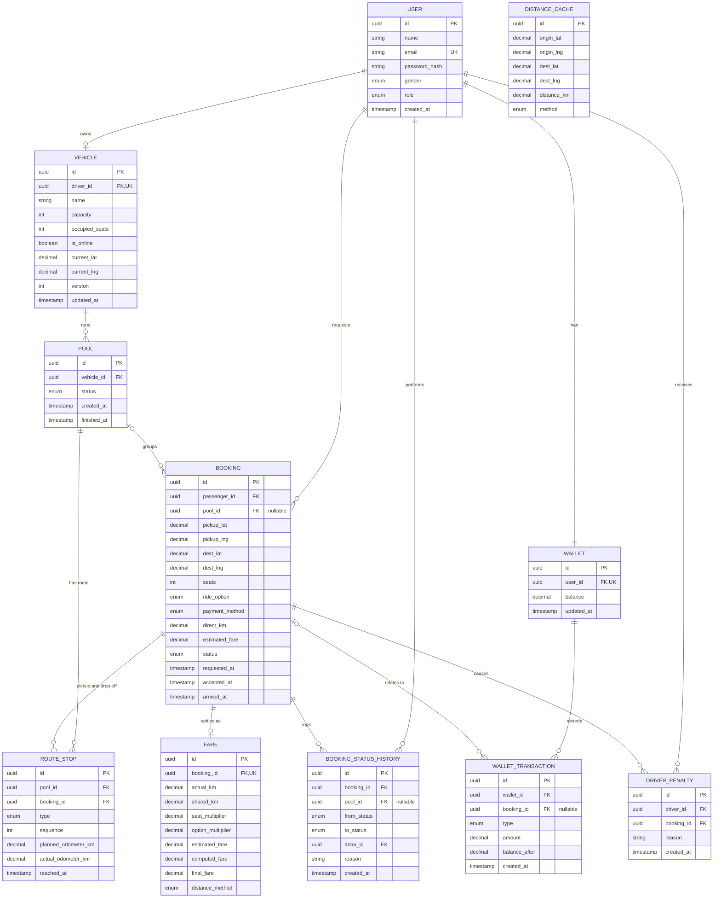

# Dhaka Tesla Pool — Core Entities

**Status:** Draft v2 (high-level; attribute details may change in the LLD)

This document lists the main things the app stores, what each one represents, and how they connect.

---

## 1. Entities

### User
A person who uses the app, either as a passenger or as a driver.
- `id`
- `name`
- `email`, used to sign in
- `password_hash`
- `gender`
- `role`: passenger or driver
- `created_at`

### Vehicle
A driver's Tesla. Each driver has exactly one.
- `id`
- `driver_id`, the owning user
- `name`, e.g. "Bullet"
- `capacity`, the total number of seats
- `occupied_seats`, the seats currently taken
- `is_online`
- `current_lat`, `current_lng`, set manually by the driver
- `version`, a change counter used to detect outdated accepts
- `created_at`, `updated_at`

### Pool
One continuous trip by one Tesla, grouping every passenger it serves on that trip.
- `id`
- `vehicle_id`
- `status`: active or finished
- `created_at`, `finished_at`

### Booking
One passenger's ride request, from the moment it's made until it's completed or cancelled.
- `id`
- `passenger_id`
- `pool_id`, the pool it currently belongs to (empty while it waits for a driver)
- `pickup_lat`, `pickup_lng`, `pickup_label`
- `dest_lat`, `dest_lng`, `dest_label`
- `seats`
- `ride_option`: pool, same-gender pool, or solo
- `payment_method`: cash or TeslaPay
- `direct_km`, the road distance from pickup to destination at request time
- `estimated_fare`
- `status`: requested, accepted, driver arrived, started, completed or cancelled
- `requested_at`, `accepted_at`, `arrived_at`, `started_at`, `completed_at`, `cancelled_at`

### RouteStop
One stop on a pool's route: a pickup or a drop-off for one booking.
- `id`
- `pool_id`
- `booking_id`
- `type`: pickup or drop-off
- `sequence`, its position in the route order
- `lat`, `lng`
- `planned_odometer_km`, the expected cumulative km at this stop
- `actual_odometer_km`, copied from the planned km when the driver reaches the stop
- `reached_at`

### BookingStatusHistory
A permanent log of every status change on a booking.
- `id`
- `booking_id`
- `pool_id`, the pool the booking was in at that moment
- `from_status`, `to_status`
- `actor_id`, who made the change
- `reason`, e.g. late cancel, no-show, driver cancel
- `created_at`

### Fare
A frozen record of how a booking's final fare was calculated, so anyone can check it by hand.
- `id`
- `booking_id`
- `pickup_odometer_km`, `dropoff_odometer_km`
- `actual_km`, `shared_km`, `direct_km`
- `seats`, `seat_multiplier`
- `ride_option`, `option_multiplier`
- `estimated_fare`, `computed_fare`, `final_fare`
- `distance_method`: routed or straight-line fallback
- `created_at`

### Wallet
A user's TeslaPay balance.
- `id`
- `user_id`
- `balance`, which can go negative only because of a fine
- `updated_at`

### WalletTransaction
A permanent, add-only record of every money movement.
- `id`
- `wallet_id`
- `booking_id`, if the movement is related to a ride
- `type`: top-up, fare payment, driver credit, cash earning, or fine
- `amount`
- `balance_after`
- `created_at`

### DriverPenalty
A record that a driver cancelled late.
- `id`
- `driver_id`
- `booking_id`
- `reason`
- `created_at`

### DistanceCache (supporting)
Saved road distances, so the map service isn't asked for the same distance twice.
- `id`
- `origin_lat`, `origin_lng`, `dest_lat`, `dest_lng`
- `distance_km`
- `method`
- `created_at`

---

## 2. ERD

Some timestamp columns are left out of the diagram to keep it readable; the lists in Section 1 are the full set.

---

## 3. Decisions made

| Topic | Decision |
|---|---|
| Users | One User table with a role (passenger or driver), not separate tables. |
| Sign-in | Email and password only. Email verification and Google sign-in are out of scope. |
| IDs | UUIDs for every entity. |
| Pool membership | Each booking stores the pool it currently belongs to (`booking.pool_id`). There is no separate membership table. If a driver cancels, the status history keeps a record of the pool the booking left. |
| Seat count | The number of occupied seats and the change counter live on Vehicle, so there is one place to check and lock when accepting. |
| Fare | Stored as its own record, separate from Booking, and never changed once written. |
| Stop order | The driver must follow the planned stop order; the app only offers the next stop. |
| Km readings | When the driver reaches a stop, its planned km is copied as the actual reading. No distance is calculated at that moment. |
| Route changes | When a passenger joins or cancels, only the stops not yet reached get new planned km. Readings of reached stops never change. |
| Cancelled bookings in a route | Their route stops are deleted, and the rest of the route is re-planned. |
| Not stored as entities | Login sessions (a signed cookie is enough), Dhaka zones (fallback only), duplicate-request keys (covered by other rules), ratings and a general audit log (out of scope). |

---

## 4. Still to decide

Nothing is open at this level. Remaining details, such as where a new passenger's stops are inserted into an existing route, are left for the LLD.
